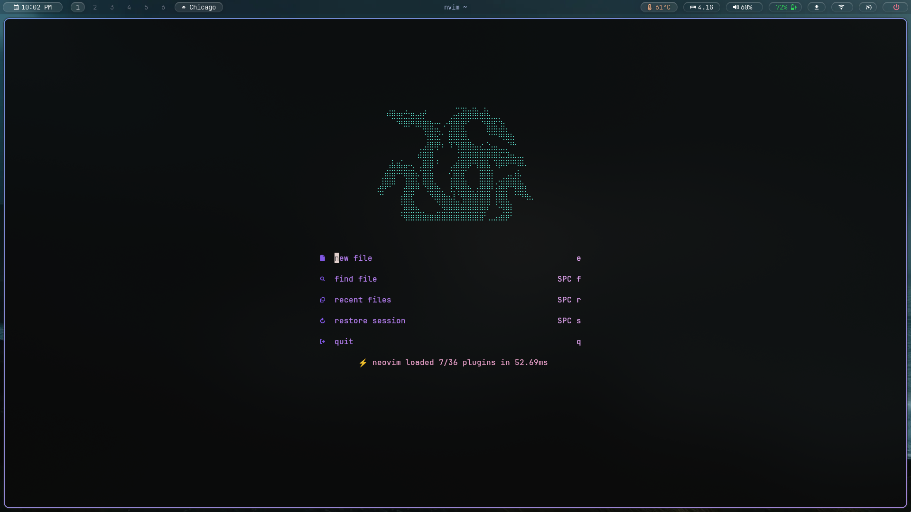

# Nyx Hyprland

My personal Hyprland setup for EndeavourOS.

A clean, keyboard-driven desktop focused on programming, terminal workflows, and minimal distractions.

## Screenshot



## Components

- Hyprland
- Waybar
- Kitty
- Wofi
- Hyprlock
- Hypridle
- Fish
- Starship
- Catppuccin Mocha

## Features

- Rounded corners and blur
- Opacity toggle from Waybar
- Natural touchpad scrolling
- Workspace navigation
- Custom wallpaper loader
- Hyprlock + Hypridle integration

## Installation

```bash
git clone git@github.com:ChitranshAherwar/nyx-hyprland.git
```

Copy the required files into:

```text
~/.config/hypr
~/.config/waybar
```

Reload Hyprland:

```bash
hyprctl reload
```

## Notes

This repository serves as both a backup and a record of my migration from i3wm to Hyprland.

If something breaks, it was probably working five minutes ago.
